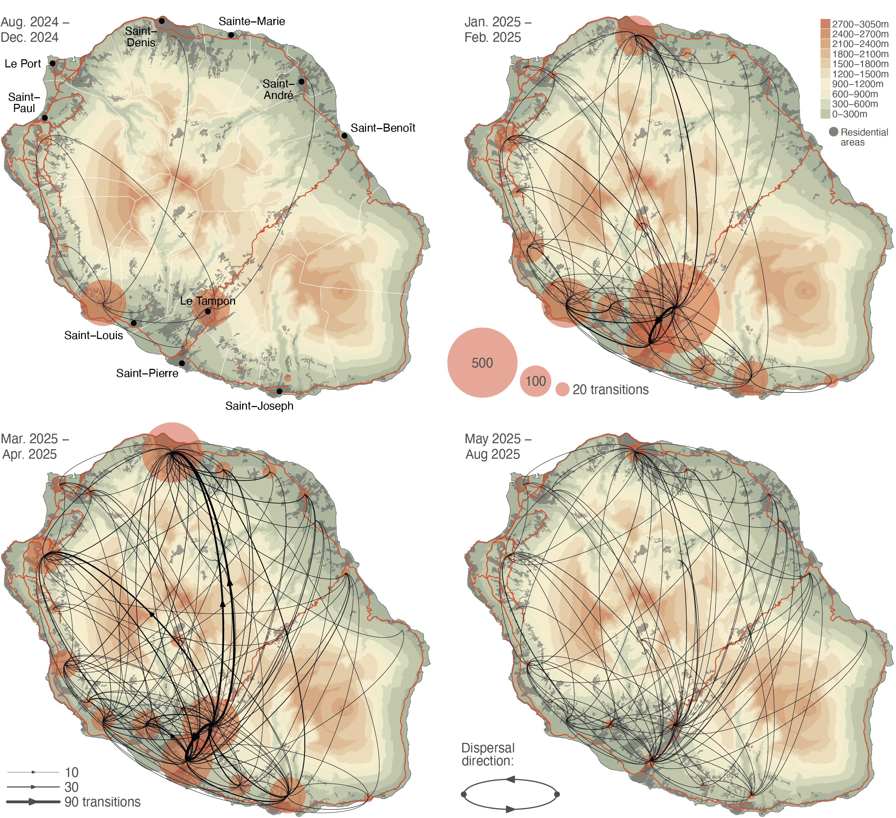

Chikungunya virus outbreak on the Réunion island
===============

This repo gathers the input files and scripts related to our study entitled "**Unravelling the epidemiological and dispersal dynamics of the 2024-2025 chikungunya virus outbreak on Réunion island**" ([Frumence *et al*., *submitted*](https://www.medrxiv.org/content/10.64898/2026.01.07.26343606v1)). The commented R code used to conduct data processing and the analysis of the different phylodynamic and phylogeographic reconstructions performed in this study – summarised in Figures 1 and 2 below, respectively – is gathered in the file `Script_CHIKV_study.r` (see also below for the different software requirements).

Réunion island just experienced a massive chikungunya virus outbreak in 2024-2025, with more than 54,000 confirmed cases. This is the second major chikungunya outbreak on the island, following the first one that peaked 20 years ago. While it has been assessed that this new outbreak finds its origin in a single introduction event into the island, offering a unique opportunity to exploit viral genomic data to understand the epidemiological and dispersal dynamics of the introduced transmission chain. We sequenced >3,000 near-full viral genomes collected during the course of the epidemic. Exploiting this genomic dataset, we used a set of phylodynamic and phylogeographic approaches to unravel the paths taken by the transmission chain and the external factors having impacted its dynamics on the island. Our analyses highlight a dispersal pattern in line with a gravity-model dynamic with viral transition events being more frequent from and toward more populated areas. While we find that dispersal events were on average more likely between geographically close locations, our analyses also reveal that the transmission chain was overall spatially intermixed, with frequent exchanges among distinct residential areas. In addition, we show that the decrease in transmission rate leading to the end of the epidemic can, at least to a large extent, be attributed to the population immunity resulting from both the current and the 2005-2006 epidemic. The dispersal and epidemiological dynamics of the outbreak have been shaped by the spatial distribution of the human population and by its growing immunity, respectively. While a short-term resurgence of viral transmission cannot be excluded, the impact of herd immunity constitutes an encouraging outcome that should at least contribute to limiting the spread of the virus in the upcoming seasons.

**Figure 1. Sampling map and phylodynamic analyses of the 2024-2025 chikungunya virus (CHIKV) outbreak on Réunion island. A**: topographic map of the island displaying the spatio-temporal distribution of the CHIKV genomic samples collected and sequenced during the outbreak (dots coloured according to sampling date). On this map, red lines and grey areas correspond to the main roads and residential areas, respectively. **B**: distribution of the number of reported CHIKV cases on a weekly basis (histogram coloured according to time), as well as the evolution of monthly average of the temperature (red curve) and total precipitation (blue curve) during the course of the outbreak. **C**: dynamics through time of the overall effective viral population size (Ne) as estimated with a phylodynamic analysis based on sampling-aware skygrid analysis; the grey curve and surrounding ribbon corresponding to the posterior median estimate and associated 95% highest posterior density (HPD) intervals, respectively. D: dynamics through time of the effective reproduction number (Rt) as estimated with a phylodynamic analysis based on an episodic birth-death-sampling model; with vertical boxes coloured according to time corresponding to weekly 95% HPD intervals, and the grey thick lines to weekly posterior median estimates (see the text for further detail on both the sampling-aware skygrid and episodic birth-death-sampling analyses).

**Figure 2. Phylogeographic analysis of the dispersal history of viral lineages during the 2024-2025 chikungunya virus (CHIKV) outbreak on Réunion island.** The maps correspond to four successive snapshots displaying the discrete phylogeographic reconstruction of the dispersal history of CHIKV lineages conducted at the municipality level. On these maps, municipalities are associated with a transparent red dot with the size being proportional to the number of inferred lineages within the considered municipality (each dot having been placed at the centroid point computed from the sampling locations of all genomic sequences collected in the municipality), and curved arrows illustrate with their thickness the expected number of viral lineage transition events inferred from one municipality to another during the considered time period. These topographic maps are coloured according to the altitude or in grey when corresponding to residential areas. Red lines correspond to the main roads on the island and, solely reported on the first map, white lines correspond to the borders of the municipalities. On this first map, we also report the position and names of the main urban areas (dark grey dots). See also the GitHub repository associated with the present study for an animation of the discrete phylogeographic reconstruction generated with the [spread.gl](https://github.com/GuyBaele/SpreadGL) program.

https://github.com/user-attachments/assets/8f9da42a-2186-4795-8510-f4dfe5538e3d

### Programs used in this study, software requirements, and computation times

Viral genomic alignments were conduct using [MAFFT](https://mafft.cbrc.jp/alignment/server/index.html) v7.51134 and inspected manually using the program [AliView](https://ormbunkar.se/aliview/) v1.035. The initial maximum-likelihood (ML) phylogenetic analysis involving non-Réunion sequences and a subset of the Réunion sequences was performed with [IQ-TREE](https://iqtree.github.io/) v1.6.1236 using the best-fit substitution model identified by ModelFinder. Based on the resulting ML phylogenetic tree, the program [TempEst](https://tree.bio.ed.ac.uk/software/tempest/) was then used to conduct a root-to-tip regression to assess the temporal signal associated with the genomic alignment. All time-scaled phylogenetic inferences (including all the phylodynamic and phylogeographic analyses) were conducted with the software package [BEAST X](https://beast.community/programs) v1.10.5, which was coupled with the [BEAGLE](https://github.com/beagle-dev/beagle-lib) v.4.0.0 library to improve computational performance. Markov chain Monte Carlo (MCMC) convergence and mixing was systematically assessed with the program [Tracer](https://beast.community/programs) v1.743, and the maximum clade credibility (MCC) trees were retrieved and annotated with the program [TreeAnnotator](https://beast.community/programs) v1.10.5. All the remaining data analyses and visualisations were done in [R](https://www.r-project.org/) v4.5.2 using custom scripts as well as functions from the R package "[seraphim](https://github.com/sdellicour/seraphim)" v2.0 – see the different software web page for the respective installation guide. In addition, the following R packages – all available on [CRAN](https://cran.r-project.org/) – were used for the data analyses and visualisation (see the file `Script_CHIKV_study.r` for further detail): "adephylo" (to manipulate phylogenetic tree objects), "colorspace" (to retrieve colour scales), "diagram" (used by the package "seraphim" to draw curves), "HDInterval" (to compute highest posterior density intervals), "lubridate" (to convert date formats), "MetBrewer" (to retrieve colour scales), as well as "raster" and "sf" (to manipulate of GIS objects). In addition, we also used the R package "treeio" (to manipulate phylogenetic tree objects) available on [Bioconductor](https://www.bioconductor.org/packages/release/bioc/html/treeio.html). Except for the time-scaled phylogenetic inferences (including all the phylodynamic and phylogeographic analyses), all the analyses were ran locally on a desktop computer (Apple MacStudio) with MacOS 26.2. All time-scaled phylogenetic analyses were ran using the GPU resources of the Linux virtual machine of the Spatial Epidemiology Lab (SpELL), which is maintained by the Informatic Department of the University of Brussels (ULB). On GPU nodes, these phylogenetic inferences required from 2 to 8 weeks to complete.
