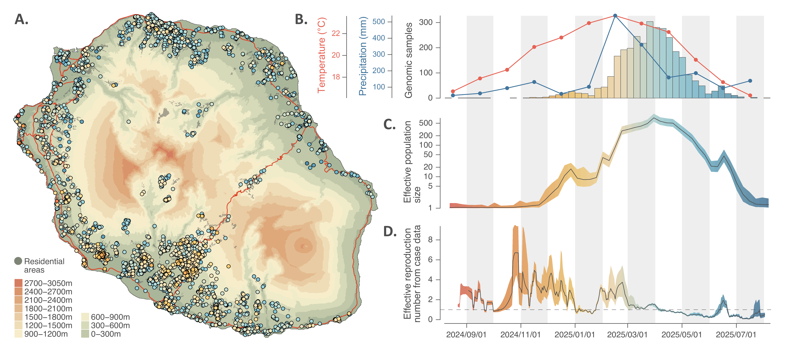

Chikungunya virus outbreak on the Réunion island
===============

This repo gathers the input files and scripts related to our study entitled "**Unraveling the dispersal dynamic of the 2024-2025 chikungunya virus outbreak on the Réunion island**" (**in prep**.). R scripts used to conduct the different phylodynamic analyses described in that study are all available in `Script_CHIKV_study.r`.

