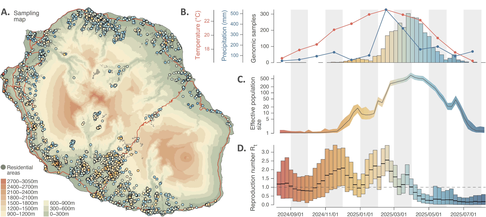

Chikungunya virus outbreak on the Réunion island
===============

This repo gathers the input files and scripts related to our study entitled "**Unraveling the epidemiological and dispersal dynamics of the 2024-2025 chikungunya virus outbreak on Réunion island**" (*in prep*.). R scripts used to conduct the different phylodynamic analyses described in that study are all available in `Script_CHIKV_study.r`.

**Figure 1. Sampling map and phylodynamic analyses of the epidemiological dynamic of the 2024-2025 chikungunya virus (CHIKV) outbreak on Réunion island. A**: topographic map of the island displaying the spatio-temporal distribution of the CHIKV genomic samples collected and sequenced during the outbreak (dots coloured according to sampling date). On this map, red lines and grey areas correspond to the main roads and residential areas, respectively. **B**: distribution of the number of reported CHIKV cases on a weekly basis (histogram coloured according to time), as well as the evolution of monthly average of the temperature (red curve) and total precipitation (blue curve) during the course of the outbreak. **C**: evolution through time of the overall effective size (Ne) of the viral population as estimated with a phylodynamic analysis based on sampling-aware skygrid analysis; the grey curve and surrounding ribbon corresponding to the median estimate and associated 95% highest posterior density (HPD) region, respectively. **D**: evolution through time of the effective reproduction number (Rt) as estimated with a phylodynamic analysis based on an episodic birth-death-sampling model; with vertical boxes coloured according to time corresponding to weekly 95% HPD intervals, and the grey thick lines to weekly median estimates (see the text for further detail on both the sampling-aware skygrid and episodic birth-death-sampling analyses).

**Figure 2. Phylogeographic analysis of the dispersal history of viral lineages during the 2024-2025 chikungunya virus (CHIKV) outbreak on Réunion island.** The maps correspond to four successive snapshots displaying the discrete phylogeographic reconstruction of the dispersal history of CHIKV lineages conducted at the municipality level. On these maps, municipalities are associated with a transparent red dot with the size being proportional to the number of inferred transition events within the considered municipality (each dot having been placed at the centroid point computed from the sampling locations of all genomic sequences collected in the municipality), and curved arrows illustrate with their thickness the number of viral lineage transition events inferred from one municipality to another during the considered time period. These topographic maps are coloured according to the altitude or in grey when corresponding to residential areas. Red lines correspond to the main roads on the island and, solely reported on the first map, white lines correspond to the borders of the municipalities. On this first map, we also report the position and names of the main urban areas (dark grey dots). See also below for an animation of the discrete phylogeographic reconstruction generated with the [spread.gl](https://github.com/GuyBaele/SpreadGL) program.

https://github.com/user-attachments/assets/8f9da42a-2186-4795-8510-f4dfe5538e3d
